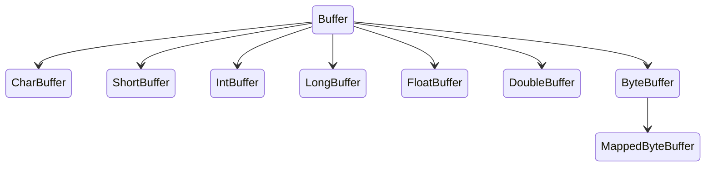
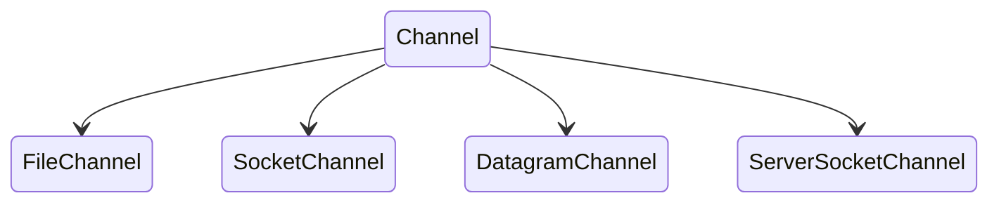

## 概述
java.nio全称java non-blocking IO，是指JDK1.4 及以上版本里提供的新api（New IO） ，为所有的原始类型（boolean类型除外）提供缓存支持的数据容器，使用它可以提供非阻塞式的高伸缩性网络  
与BIO(阻塞式IO)相比，NIO只有在连接/通道真正有读写事件发生时(事件驱动)，才会创建线程进行读写，不必为每一个连接都创建一个线程。这样就大大地减少了系统的开销。
## 核心组件
| 组件 | 解释 | 作用 |
|----|----|---|
| Buffer | 缓冲区 | 存储数据 |
| Channel | 通道 | 传输数据 |
| Selecteor | 选择器 | 控制器 |
### Buffer
Buffer是一个内存块。在NIO中，所有的数据都是用Buffer处理，有读写两种模式。所以NIO和传统的IO的区别就体现在这里。传统IO是面向Stream流，NIO而是面向缓冲区(Buffer)。  
java.nio 定义了以下几个Buffer 的实现


我们经常用到的也是最核心的是ByteBuffer，其余的类只是包装了一下ByteBuffer。  
我们应该将 Buffer 理解为一个数组，IntBuffer、CharBuffer、DoubleBuffer 等分别对应 int[]、char[]、double[] 等。
操作 Buffer 和操作数组差不多，只不过大部分时候我们都把它放到了 NIO 的场景里面来使用而已。下面介绍 Buffer 中的几个重要属性和几个重要方法。
#### position、limit、capacity
就像数组有数组容量，每次访问元素要指定下标，Buffer 中也有几个重要属性：position、limit、capacity。  


1. capacity，为缓冲区的容量
2. position 代表下一次的写入位置，初始值是0，每往Buffer中写入一个值，position就自动加 1。读操作的时候也是类似的，每读一个值，position 就自动加 1。
> 从写操作模式到读操作模式切换的时候（flip），position 都会归零，这样就可以从头开始读写了。
3. limit：写操作模式下，limit 代表的是最大能写入的数据，这个时候 limit 等于 capacity。写结束后，切换到读模式，此时的 limit 等于 Buffer 中实际的数据大小，因为 Buffer 不一定被写满了。


#### 初始化Buffer
每个 Buffer 实现类都提供了一个静态方法 allocate(int capacity) 帮助我们快速实例化一个 Buffer。如：
~~~java
ByteBuffer byteBuf = ByteBuffer.allocate(1024);
IntBuffer intBuf = IntBuffer.allocate(1024);
LongBuffer longBuf = LongBuffer.allocate(1024);
// ...
~~~
另外，我们经常使用 wrap 方法来初始化一个 Buffer。
~~~java
public static ByteBuffer wrap(byte[] array) {
    // ...
}
~~~

#### 填充Buffer
各个 Buffer 类都提供了一些 put 方法用于将数据填充到 Buffer 中，如 ByteBuffer 中的几个 put 方法：
~~~java
// 填充一个 byte 值
public abstract ByteBuffer put(byte b);
// 在指定位置填充一个 int 值
public abstract ByteBuffer put(int index, byte b);
// 将一个数组中的值填充进去
public final ByteBuffer put(byte[] src) {...}
public ByteBuffer put(byte[] src, int offset, int length) {...}
~~~
上述这些方法需要自己控制 Buffer 大小，不能超过 capacity，超过会抛 java.nio.BufferOverflowException 异常。  
对于 Buffer 来说，另一个常见的操作中就是，我们要将来自 Channel 的数据填充到 Buffer 中，在系统层面上，这个操作我们称为读操作，因为数据是从外部（文件或网络等）读到内存中。
~~~java
int num = channel.read(buf);
~~~

#### 提取 Buffer 中的值
前面介绍了写操作，每写入一个值，position 的值都需要加 1，所以 position 最后会指向最后一次写入的位置的后面一个，如果 Buffer 写满了，那么 position 等于 capacity（position 从 0 开始）。  
如果要读 Buffer 中的值，需要切换模式，从写入模式切换到读出模式。注意，通常在说 NIO 的读操作的时候，我们说的是从 Channel 中读数据到 Buffer 中，对应的是对 Buffer 的写入操作，初学者需要理清楚这个。  
调用 Buffer 的 flip() 方法，可以从写入模式切换到读取模式。其实这个方法也就是设置了一下 position 和 limit 值罢了。
~~~java
public final Buffer flip() {
    limit = position; // 将 limit 设置为实际写入的数据数量
    position = 0; // 重置 position 为 0
    mark = -1; // mark 之后再说
    return this;
}
~~~
对应写入操作的一系列 put 方法，读操作提供了一系列的 get 方法：
~~~java
// 根据 position 来获取数据
public abstract byte get();
// 获取指定位置的数据
public abstract byte get(int index);
// 将 Buffer 中的数据写入到数组中
public ByteBuffer get(byte[] dst)
~~~
附一个经常使用的方法：
~~~java
new String(buffer.array()).trim();
~~~
当然了，除了将数据从 Buffer 取出来使用，更常见的操作是将我们写入的数据传输到 Channel 中，如通过 FileChannel 将数据写入到文件中，通过 SocketChannel 将数据写入网络发送到远程机器等。对应的，这种操作，我们称之为写操作。
~~~java
int num = channel.write(buf);
~~~

#### mark() & reset()
除了 position、limit、capacity 这三个基本的属性外，还有一个常用的属性就是 mark。  
mark 用于临时保存 position 的值，每次调用 mark() 方法都会将 mark 设值为当前的 position，便于后续需要的时候使用。  
~~~java
public final Buffer mark() {
    mark = position;
    return this;
}
~~~
那到底什么时候用呢？考虑以下场景，我们在 position 为 5 的时候，先 mark() 一下，然后继续往下读，读到第 10 的时候，我想重新回到 position 为 5 的地方重新来一遍，那只要调一下 reset() 方法，position 就回到 5 了。  
~~~java
public final Buffer reset() {
    int m = mark;
    if (m < 0)
        throw new InvalidMarkException();
    position = m;
    return this;
}
~~~

#### rewind() & clear() & compact()
rewind()：会重置 position 为 0，通常用于重新从头读写 Buffer。  
~~~java
public final Buffer rewind() {
    position = 0;
    mark = -1;
    return this;
}
~~~
clear()：有点重置 Buffer 的意思，相当于重新实例化了一样。  
通常，我们会先填充 Buffer，然后从 Buffer 读取数据，之后我们再重新往里填充新的数据，我们一般在重新填充之前先调用 clear()。
~~~java
public final Buffer clear() {
    position = 0;
    limit = capacity;
    mark = -1;
    return this;
}
~~~
compact()：和 clear() 一样的是，它们都是在准备往 Buffer 填充新的数据之前调用。  
前面说的 clear() 方法会重置几个属性，但是我们要看到，clear() 方法并不会将 Buffer 中的数据清空，只不过后续的写入会覆盖掉原来的数据，也就相当于清空了数据了。  
而 compact() 方法有点不一样，调用这个方法以后，会先处理还没有读取的数据，也就是 position 到 limit 之间的数据（还没有读过的数据），先将这些数据移到左边，然后在这个基础上再开始写入。很明显，此时 limit 还是等于 capacity，position 指向原来数据的右边。

### Channel
所有的 NIO 操作始于通道，通道是数据来源或数据写入的目的地，主要地，我们将关心 java.nio 包中实现的以下几个 Channel：

- FileChannel：文件通道，用于文件的读和写
- DatagramChannel：用于 UDP 连接的接收和发送
- SocketChannel：把它理解为 TCP 连接通道，简单理解就是 TCP 客户端
- ServerSocketChannel：TCP 对应的服务端，用于监听某个端口进来的请求

这里不是很理解这些也没关系，后面介绍了代码之后就清晰了。还有，我们最应该关注，也是后面将会重点介绍的是 SocketChannel 和 ServerSocketChannel。  
Channel 经常翻译为通道，类似 IO 中的流，用于读取和写入。它与前面介绍的 Buffer 打交道，读操作的时候将 Channel 中的数据填充到 Buffer 中，而写操作时将 Buffer 中的数据写入到 Channel 中。  
至少读者应该记住一点，这两个方法都是 channel 实例的方法。

#### SocketChannel
我们前面说了，我们可以将 SocketChannel 理解成一个 TCP 客户端。虽然这么理解有点狭隘，因为我们在介绍 ServerSocketChannel 的时候会看到另一种使用方式。  
打开一个 TCP 连接：
~~~java
SocketChannel socketChannel = SocketChannel.open(new InetSocketAddress("http://localhost", 80));
~~~
当然了，上面的这行代码等价于下面的两行：
~~~java
// 打开一个通道
SocketChannel socketChannel = SocketChannel.open();
// 发起连接
socketChannel.connect(new InetSocketAddress("http://localhost", 80));
~~~
SocketChannel 的读写和 FileChannel 没什么区别，就是操作缓冲区。
~~~java
// 读取数据
socketChannel.read(buffer);

// 写入数据到网络连接中
while(buffer.hasRemaining()) {
    socketChannel.write(buffer);   
}
~~~

#### ServerSocketChannel
之前说 SocketChannel 是 TCP 客户端，这里说的 ServerSocketChannel 就是对应的服务端。  
ServerSocketChannel 用于监听机器端口，管理从这个端口进来的 TCP 连接。
~~~java
// 实例化
ServerSocketChannel serverSocketChannel = ServerSocketChannel.open();
// 监听 8080 端口
serverSocketChannel.socket().bind(new InetSocketAddress(8080));

while (true) {
    // 一旦有一个 TCP 连接进来，就对应创建一个 SocketChannel 进行处理
    SocketChannel socketChannel = serverSocketChannel.accept();
}
~~~
> 这里我们可以看到 SocketChannel 的第二个实例化方式

到这里，我们应该能理解 SocketChannel 了，它不仅仅是 TCP 客户端，它代表的是一个网络通道，可读可写。  
ServerSocketChannel 不和 Buffer 打交道了，因为它并不实际处理数据，它一旦接收到请求后，实例化 SocketChannel，之后在这个连接通道上的数据传递它就不管了，因为它需要继续监听端口，等待下一个连接。
  
### Selector
NIO 三大组件就剩 Selector 了，Selector 建立在非阻塞的基础之上，大家经常听到的 多路复用 在 Java 世界中指的就是它，用于实现一个线程管理多个 Channel。  
- 首先，我们开启一个 Selector。你们爱翻译成选择器也好，多路复用器也好。
    ~~~java
    Selector selector = Selector.open();
    ~~~
- 将 Channel 注册到 Selector 上。前面我们说了，Selector 建立在非阻塞模式之上，所以注册到 Selector 的 Channel 必须要支持非阻塞模式，FileChannel 不支持非阻塞，我们这里讨论最常见的 SocketChannel 和 ServerSocketChannel。
    ~~~java
    // 将通道设置为非阻塞模式，因为默认都是阻塞模式的
    channel.configureBlocking(false);
    // 注册
    SelectionKey key = channel.register(selector, SelectionKey.OP_READ);
    ~~~
    register 方法的第二个 int 型参数（使用二进制的标记位）用于表明需要监听哪些感兴趣的事件，共以下四种事件：
    - SelectionKey.OP_READ
    > 对应 00000001，通道中有数据可以进行读取
    - SelectionKey.OP_WRITE
    > 对应 00000100，可以往通道中写入数据
    - SelectionKey.OP_CONNECT
    > 对应 00001000，成功建立 TCP 连接
    - SelectionKey.OP_ACCEPT
    > 对应 00010000，接受 TCP 连接

    我们可以同时监听一个 Channel 中的发生的多个事件，比如我们要监听 ACCEPT 和 READ 事件，那么指定参数为二进制的 00010001 即十进制数值 17 即可。  
    注册方法返回值是 SelectionKey 实例，它包含了 Channel 和 Selector 信息，也包括了一个叫做 Interest Set 的信息，即我们设置的我们感兴趣的正在监听的事件集合。  
- 调用 select() 方法获取通道信息。用于判断是否有我们感兴趣的事件已经发生了。

Selector 的操作就是以上 3 步，这里来一个简单的示例，具体可执行的示例会在下一节给出
~~~java
Selector selector = Selector.open();

channel.configureBlocking(false);

SelectionKey key = channel.register(selector, SelectionKey.OP_READ);

while(true) {
  // 判断是否有事件准备好
  int readyChannels = selector.select();
  if(readyChannels == 0) continue;

  // 遍历
  Set<SelectionKey> selectedKeys = selector.selectedKeys();
  Iterator<SelectionKey> keyIterator = selectedKeys.iterator();
  while(keyIterator.hasNext()) {
    SelectionKey key = keyIterator.next();

    if(key.isAcceptable()) {
        // a connection was accepted by a ServerSocketChannel.

    } else if (key.isConnectable()) {
        // a connection was established with a remote server.

    } else if (key.isReadable()) {
        // a channel is ready for reading

    } else if (key.isWritable()) {
        // a channel is ready for writing
    }

    keyIterator.remove();
  }
}
~~~

对于 Selector，我们还需要非常熟悉以下几个方法：
- select()  
  调用此方法，会将上次 select 之后的准备好的 channel 对应的 SelectionKey 复制到 selected set 中。如果没有任何通道准备好，这个方法会阻塞，直到至少有一个通道准备好。
- selectNow()  
  功能和 select 一样，区别在于如果没有准备好的通道，那么此方法会立即返回 0。
- select(long timeout)  
  看了前面两个，这个应该很好理解了，如果没有通道准备好，此方法会等待一会
- wakeup()  
  这个方法是用来唤醒等待在 select() 和 select(timeout) 上的线程的。如果 wakeup() 先被调用，此时没有线程在 select 上阻塞，那么之后的一个 select() 或 select(timeout) 会立即返回，而不会阻塞，当然，它只会作用一次。

## 示例
### 服务端
```java
public class NIOServer {
    public static void main(String[] args) throws Exception {
        // 打开一个ServerSocketChannel
        ServerSocketChannel serverSocketChannel = ServerSocketChannel.open();
        InetSocketAddress address = new InetSocketAddress("127.0.0.1", 6666);
        // 绑定地址
        serverSocketChannel.bind(address);
        // 设置为非阻塞
        serverSocketChannel.configureBlocking(false);
        // 打开一个选择器
        Selector selector = Selector.open();
        // serverSocketChannel注册到选择器中,监听连接事件
        serverSocketChannel.register(selector, SelectionKey.OP_ACCEPT);
        // 循环等待客户端的连接
        while (true) {
            // 等待3秒，（返回0相当于没有事件）如果没有事件，则跳过
            if (selector.select(3000) == 0) {
                System.out.println("服务器等待3秒，没有连接");
                continue;
            }
            // 如果有事件selector.select(3000)>0的情况,获取事件
            Set<SelectionKey> selectionKeys = selector.selectedKeys();
            // 获取迭代器遍历
            Iterator<SelectionKey> it = selectionKeys.iterator();
            while (it.hasNext()) {
                // 获取到事件
                SelectionKey selectionKey = it.next();
                // 判断如果是连接事件
                if (selectionKey.isAcceptable()) {
                    // 服务器与客户端建立连接，获取socketChannel
                    SocketChannel socketChannel = serverSocketChannel.accept();
                    // 设置成非阻塞
                    socketChannel.configureBlocking(false);
                    // 把socketChannel注册到selector中，监听读事件，并绑定一个缓冲区
                    socketChannel.register(selector, SelectionKey.OP_READ, ByteBuffer.allocate(1024));
                }
                // 如果是读事件
                if (selectionKey.isReadable()) {
                    //获取通道
                    SocketChannel socketChannel = (SocketChannel) selectionKey.channel();
                    // 获取关联的ByteBuffer
                    ByteBuffer buffer = (ByteBuffer) selectionKey.attachment();
                    // 打印从客户端获取到的数据
                    socketChannel.read(buffer);
                    System.out.println("from 客户端：" + new String(buffer.array()));
                }
                // 从事件集合中删除已处理的事件，防止重复处理
                it.remove();
            }
        }
    }
}
```

### 客户端

```java
public class NIOClient {
    public static void main(String[] args) throws Exception {
        SocketChannel socketChannel = SocketChannel.open();
        InetSocketAddress address = new InetSocketAddress("127.0.0.1", 6666);
        socketChannel.configureBlocking(false);
        // 连接服务器
        boolean connect = socketChannel.connect(address);
        // 判断是否连接成功
        if(!connect){
            // 等待连接的过程中
            while (!socketChannel.finishConnect()){
                System.out.println("连接服务器需要时间，期间可以做其他事情...");
            }
        }
        String msg = "hello world！";
        ByteBuffer byteBuffer = ByteBuffer.wrap(msg.getBytes());
        // 把byteBuffer数据写入到通道中
        socketChannel.write(byteBuffer);
        // 让程序卡在这个位置，不关闭连接
        System.in.read();
    }
}
```
## 参考文献
> [NIO从入门到踹门](https://mp.weixin.qq.com/s?__biz=MzU1OTgzNTAzNQ==&mid=2247483835&idx=1&sn=03d35c05c514ca671331e7e117684143&chksm=fc10734fcb67fa59b5f0977c91d4a70212acb1bdff46fb5770e1bfb52f425c3bb0753d3e6403&scene=178&cur_album_id=1445826382487207937#rd)  
> [Java 非阻塞 IO 和异步 IO](https://www.javadoop.com/post/java-nio)