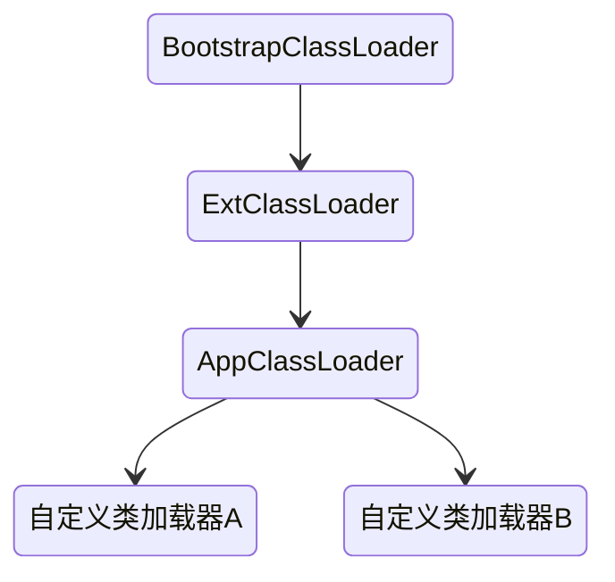
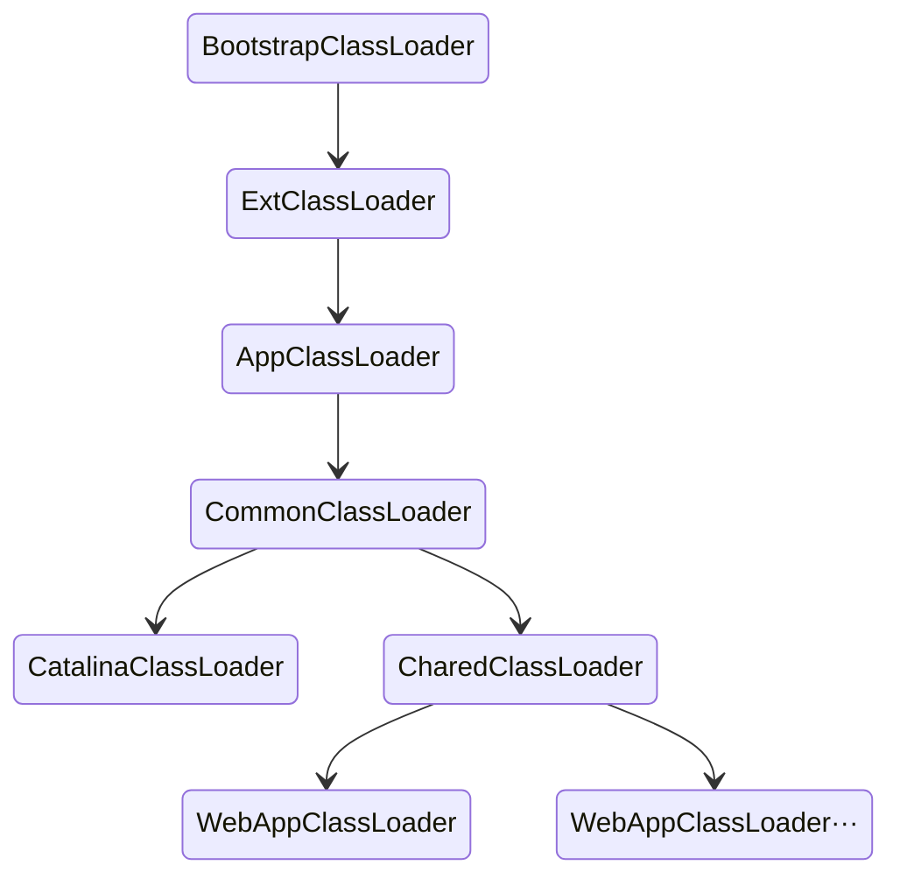

## 总体架构

Tomcat 要实现 2 个核心功能：

1. 处理 Socket 连接，负责网络字节流与 Request 和 Response 对象的转化。
2. 加载和管理 Servlet，以及具体处理 Request 请求。

Tomcat 设计了两个核心组件连接器（Connector）和容器（Container）来分别做这两件事情。连接器负责对外交流，容器负责内部处理。

最顶层是 Server，这里的 Server 指的就是一个 Tomcat 实例。一个 Server 中有一个或者多个 Service，一个 Service 中有多个连接器和一个容器。连接器与容器之间通过标准的 ServletRequest 和 ServletResponse 通信。

结构设计可以通过 conf/server.xml 的配置体现。

server.xml 配置如下：

```xml
<?xml version="1.0" encoding="UTF-8"?>
<Server port="8005" shutdown="SHUTDOWN">
  <Service name="Catalina">
    <Connector port="8080" protocol="HTTP/1.1"
               connectionTimeout="20000"
               redirectPort="8443" />
    <Engine name="Catalina" defaultHost="localhost">
      <Realm className="org.apache.catalina.realm.LockOutRealm">
        <Realm className="org.apache.catalina.realm.UserDatabaseRealm"
               resourceName="UserDatabase"/>
      </Realm>
      <Host name="localhost"  appBase="webapps"
            unpackWARs="true" autoDeploy="true">
        <Valve className="org.apache.catalina.valves.AccessLogValve" directory="logs"
               prefix="localhost_access_log" suffix=".txt"
               pattern="%h %l %u %t &quot;%r&quot; %s %b" />
      </Host>
    </Engine>
  </Service>
</Server>

```

### 连接器（Connector）

连接器需要完成 3 个功能：

1. 网络通信，处理 Socket 连接
2. 应用层协议解析，负责网络字节流
3. Tomcat Request/Response 与 ServletRequest/ServletResponse 的转化。

Tomcat 的设计者设计了 3 个组件来实现这 3 个功能，分别是

1. EndPoint：监听接口，提供字节流给 Processor  
   EndPoint 是通信端点，即通信监听的接口，是具体的 Socket 接收和发送处理器，是对传输层的抽象，因此 EndPoint 是用来实现 TCP/IP 协议的。
   EndPoint 是一个接口，它的抽象实现类 AbstractEndpoint 里面定义了两个内部类：Acceptor 和 SocketProcessor。
   其中 Acceptor 用于监听 Socket 连接请求。SocketProcessor 用于处理接收到的 Socket 请求，它实现 Runnable 接口，在 Run 方法里调用协议处理组件 Processor 进行处理。为了提高处理能力，SocketProcessor 被提交到线程池来执行。而这个线程池叫作执行器(Executor)
2. Processor：读取字节流，提供 Tomcat Request 对象给 Adaptor  
   Processor 用来实现 HTTP 协议，Processor 接收来自 EndPoint 的 Socket，读取字节流解析成 Tomcat Request 和 Response 对象，并通过 Adapter 将其提交到容器处理，Processor 是对应用层协议的抽象。Processor 是一个接口，定义了请求的处理等方法。它的抽象实现类 AbstractProcessor 对一些协议共有的属性进行封装，没有对方法进行实现。具体的实现有 AJPProcessor、HTTP11Processor 等，这些具体实现类实现了特定协议的解析方法和请求处理方式。
3. Adaptor：处理 Tomcat Request 对象，提供 ServletRequest 对象给容器  
   连接器调用 CoyoteAdapter 的 Sevice 方法，传入的是 Tomcat Request 对象，CoyoteAdapter 负责将 Tomcat Request 转成 ServletRequest，再调用容器的 Service 方法。

其中 Endpoint 和 Processor 放在一起抽象成了 ProtocolHandler 组件

### 容器（Container）

容器负责加载和管理 Servlet，以及具体处理 Request 请求。
Tomcat 设计了 4 种父子关系的容器，分别是 Engine、Host、Context 和 Wrapper。

1. Engine：表示引擎，用来管理多个虚拟站点，一个 Service 最多只能有一个 Engine。
2. Host：代表的是一个虚拟主机，或者说一个站点，可以给 Tomcat 配置多个虚拟主机地址，而一个虚拟主机下可以部署多个 Web 应用程序；
3. Context：表示一个 Web 应用程序；
4. Wrapper：表示一个 Servlet，一个 Web 应用程序中可能会有多个 Servlet；

## Tomcat 启动流程

### Tomcat 实现一键式启停

#### 一键式启停：LifeCycle 接口

LifeCycle 接口里应该定义这么几个方法：init()、start()、stop()和 destroy()，每个具体的组件去实现这些方法。

理所当然，在父组件的 init()方法里需要创建子组件并调用子组件的 init()方法。同样，在父组件的 start()方法里也需要调用子组件的 start()方法，因此调用者可以无差别的调用各组件的 init()方法和 start()方法，这就是**组合模式**的使用，并且只要调用最顶层组件，也就是 Server 组件的 init()和 start()方法，整个 Tomcat 就被启动起来了。下面是 LifeCycle 接口的定义。

```java
public interface Lifecycle {
    public void init() throws LifecycleException;
    public void start() throws LifecycleException;
    public void stop() throws LifecycleException;
    public void destroy() throws LifecycleException;
}
```

#### 可扩展性：LifeCycle 事件

我们注意到，组件的 init()和 start()调用是由它的父组件的状态变化触发的，上层组件的初始化会触发子组件的初始化，上层组件的启动会触发子组件的启动，因此我们把组件的生命周期定义成一个个状态，把状态的转变看作是一个事件。而事件是有监听器的，在监听器里可以实现一些逻辑，并且监听器也可以方便的添加和删除，这就是典型的**观察者模式**。

具体来说就是在 LifeCycle 接口里加入两个方法：添加监听器和删除监听器。除此之外，我们还需要定义一个 Enum 来表示组件有哪些状态，以及处在什么状态会触发什么样的事件。因此 LifeCycle 接口和 LifeCycleState 就定义成了下面这样。

组件的生命周期有 NEW、INITIALIZING、INITIALIZED、STARTING_PREP、STARTING、STARTED 等，而一旦组件到达相应的状态就触发相应的事件，比如 NEW 状态表示组件刚刚被实例化；而当 init()方法被调用时，状态就变成 INITIALIZING 状态，这个时候，就会触发 BEFORE_INIT_EVENT 事件，如果有监听器在监听这个事件，它的方法就会被调用。

#### 重用性：LifeCycleBase 抽象基类

Tomcat 定义一个基类 LifeCycleBase 来实现 LifeCycle 接口，把一些公共的逻辑放到基类中去，比如生命状态的转变与维护、生命事件的触发以及监听器的添加和删除等，而子类就负责实现自己的初始化、启动和停止等方法。为了避免跟基类中的方法同名，我们把具体子类的实现方法改个名字，在后面加上 Internal，叫 initInternal()、startInternal()等

LifeCycleBase 实现了 LifeCycle 接口中所有的方法，还定义了相应的抽象方法交给具体子类去实现，这是典型的**模板设计模式**。

我们还是看一看代码，可以帮你加深理解，下面是 LifeCycleBase 的 init()方法实现。

```java
@Override
public final synchronized void init() throws LifecycleException {
    // 1. 状态检查
    if (!state.equals(LifecycleState.NEW)) {
        invalidTransition(Lifecycle.BEFORE_INIT_EVENT);
    }

    try {
        // 2.触发INITIALIZING事件的监听器
        setStateInternal(LifecycleState.INITIALIZING, null, false);

        // 3.调用具体子类的初始化方法
        initInternal();

        // 4. 触发INITIALIZED事件的监听器
        setStateInternal(LifecycleState.INITIALIZED, null, false);
    } catch (Throwable t) {
      ...
    }
}
```

### 总体流程

1. Tomcat 本质上是一个 Java 程序，因此 startup.sh 脚本会启动一个 JVM 来运行 Tomcat 的启动类 Bootstrap。
2. Bootstrap 的主要任务是初始化 Tomcat 的类加载器，并且创建 Catalina。
3. Catalina 是一个启动类，它通过解析 server.xml、创建相应的组件，并调用 Server 的 start 方法。
4. Server 组件的职责就是管理 Service 组件，它会负责调用 Service 的 start 方法。
5. Service 组件的职责就是管理连接器和顶层容器 Engine，因此它会调用连接器和 Engine 的 start 方法。这样 Tomcat 的启动就算完成了。

### Catalina

Catalina 的主要任务就是创建 Server，它不是直接 new 一个 Server 实例就完事了，而是需要解析 server.xml，把在 server.xml 里配置的各种组件一一创建出来，接着调用 Server 组件的 init 方法和 start 方法，这样整个 Tomcat 就启动起来了。

Catalina 在 JVM 中注册一个“关闭钩子”。关闭钩子”其实就是一个线程，JVM 在停止之前会尝试执行这个线程的 run 方法。当我们通过“Ctrl + C”关闭 Tomcat 时，Tomcat 的“关闭钩子”就执行 Server 的 stop 方法，Server 的 stop 方法会释放和清理所有的资源。

### Server 组件

Server 组件的具体实现类是 StandardServer。Server 继承了 LifeCycleBase，它的生命周期被统一管理，并且它的子组件是 Service，因此它还需要管理 Service 的生命周期，也就是说在启动时调用 Service 组件的启动方法，在停止时调用它们的停止方法。

Server 组件还有一个重要的任务是启动一个 Socket 来监听停止端口，这就是为什么你能通过 shutdown 命令来关闭 Tomcat。Caralina 的启动方法的最后一行代码就是调用了 Server 的 await 方法。在 await 方法里会创建一个 Socket 监听 8005 端口，并在一个死循环里接收 Socket 上的连接请求，如果有新的连接到来就建立连接，然后从 Socket 中读取数据；如果读到的数据是停止命令“SHUTDOWN”，就退出循环，进入 stop 流程。

### Service 组件

Service 组件的具体实现类是 StandardService，以下是它的定义以及关键的成员变量

```java
public class StandardService extends LifecycleBase implements Service {
    // 名字
    private String name = null;
    // Server实例
    private Server server = null;
    // 连接器数组
    protected Connector connectors[] = new Connector[0];
    private final Object connectorsLock = new Object();
    // 对应的Engine容器
    private Engine engine = null;
    // 映射器及其监听器
    protected final Mapper mapper = new Mapper();
    protected final MapperListener mapperListener = new MapperListener(this);
}
```

因为 Tomcat 支持热部署，当 Web 应用的部署发生变化时，Mapper 中的映射信息也要跟着变化，MapperListener 就是一个监听器，它监听容器的变化，并把信息更新到 Mapper 中，这是典型的观察者模式。

Service 启动方法：

```java
protected void startInternal() throws LifecycleException {
    // 1. 触发启动监听器
    setState(LifecycleState.STARTING);
    // 2. 先启动Engine，Engine会启动它子容器
    if (engine != null) {
        synchronized (engine) {
            engine.start();
        }
    }
    // 3. 再启动Mapper监听器
    mapperListener.start();
    // 4.最后启动连接器，连接器会启动它子组件，比如Endpoint
    synchronized (connectorsLock) {
        for (Connector connector: connectors) {
            if (connector.getState() != LifecycleState.FAILED) {
                connector.start();
            }
        }
    }
}
```

从启动方法可以看到，Service 先启动了 Engine 组件，再启动 Mapper 监听器，最后才是启动连接器。这很好理解，因为内层组件启动好了才能对外提供服务，才能启动外层的连接器组件。而 Mapper 也依赖容器组件，容器组件启动好了才能监听它们的变化，因此 Mapper 和 MapperListener 在容器组件之后启动。组件停止的顺序跟启动顺序正好相反的，也是基于它们的依赖关系。

### Engine 组件

最后我们再来看看顶层的容器组件 Engine 具体是如何实现的。Engine 本质是一个容器，因此它继承了 ContainerBase 基类，并且实现了 Engine 接口。

```java
public class StandardEngine extends ContainerBase implements Engine {
}
```

Engine 的子容器是 Host，所以它持有了一个 Host 容器的数组，这些功能都被抽象到了 ContainerBase 中，ContainerBase 中有这样一个数据结构：

```java
protected final HashMap<String, Container> children = new HashMap<>();
```

ContainerBase 用 HashMap 保存了它的子容器，并且 ContainerBase 还实现了子容器的“增删改查”，甚至连子组件的启动和停止都提供了默认实现，比如 ContainerBase 会用专门的线程池来启动子容器。

```java
for (int i = 0; i < children.length; i++) {
    results.add(startStopExecutor.submit(new StartChild(children[i])));
}
```

通过前面的学习，我们知道每一个容器组件都有一个 Pipeline，而 Pipeline 中有一个基础阀（Basic Valve），而 Engine 容器的基础阀定义如下：

```java
final class StandardEngineValve extends ValveBase {
    public final void invoke(Request request, Response response) throws IOException, ServletException {
        // 拿到请求中的Host容器
        Host host = request.getHost();
        if (host == null) {
            return;
        }
        // 调用Host容器中的Pipeline中的第一个Valve
        host.getPipeline().getFirst().invoke(request, response);
    }
}
```

请求到达 Engine 容器中之前，Mapper 组件已经对请求进行了路由处理，Mapper 组件通过请求的 URL 定位了相应的容器，并且把容器对象保存到了请求对象中。

## 请求处理

### 请求定位 Servlet

1. 首先，根据协议和端口号选定 Service 和 Engine。
   我们知道 Tomcat 的每个连接器都监听不同的端口，比如 Tomcat 默认的 HTTP 连接器监听 8080 端口、默认的 AJP 连接器监听 8009 端口。当我们访问监听器监听的端口时，就会被相应的连接器接收，而一个连接器是属于一个 Service 组件的，这样 Service 组件就确定了。我们还知道一个 Service 组件里除了有多个连接器，还有一个容器组件，具体来说就是一个 Engine 容器，因此 Service 确定了也就意味着 Engine 也确定了。
2. 然后，Mapper 组件通过 URL 中的域名去查找相应的 Host 容器
3. 之后，Mapper 组件根据 URL 的路径来匹配相应的 Web 应用的路径，找到 context 组件
4. 最后，Mapper 组件再根据 web.xml 中配置的 Servlet 映射路径来找到具体的 Wrapper 和 Servlet。

### 容器中的责任链调用

责任链模式(Pipeline-Valve)是指在一个请求处理的过程中有很多处理者依次对请求进行处理，每个处理者负责做自己相应的处理，处理完之后将再调用下一个处理者继续处理。

- Valve 表示一个处理点，比如权限认证和记录日志。通过 getNext 和 setNext 方法将 Valve 链起来。

```java
public interface Valve {
    public Valve getNext();
    public void setNext(Valve valve);
    public void invoke(Request request, Response response)
}
```

- Pipeline 中维护了 Valve 链表，Valve 可以插入到 Pipeline 中，对请求做某些处理

```java
public interface Pipeline extends Contained {
    public void addValve(Valve valve);
    public Valve getBasic();
    public void setBasic(Valve valve);
    public Valve getFirst();
}
```

每一个容器都有一个 Pipeline 对象，只要触发这个 Pipeline 的第一个 Valve，这个容器里 Pipeline 中的 Valve 就都会被调用到。容器的 Pipeline 通过调用 getBasic 方法获取到 BasicValve，这个 BasicValve 处于 Valve 链表的末端，它是 Pipeline 中必不可少的一个 Valve，负责调用下层容器的 Pipeline 里的第一个 Valve。
整个调用过程由连接器中的 Adapter 触发的，它会调用 Engine 的第一个 Valve：

```java
connector.getService().getContainer().getPipeline().getFirst().invoke(request, response);
```

Wrapper 容器的最后一个 Valve 会创建一个 Filter 链，并调用 doFilter()方法，最终会调到 Servlet 的 service 方法。
Valve 和 Filter 的功能相似，区别是：

- Valve 是 Tomcat 的私有机制，与 Tomcat 的基础架构/API 是紧耦合的。Servlet API 是公有的标准，所有的 Web 容器包括 Jetty 都支持 Filter 机制。
- 另一个重要的区别是 Valve 工作在 Web 容器级别，拦截所有应用的请求；而 Servlet Filter 工作在应用级别，只能拦截某个 Web 应用的所有请求。如果想做整个 Web 容器的拦截器，必须通过 Valve 来实现。

## 线程池

### Java 线程池：ThreadPoolExecutor

Java 线程池核心类 ThreadPoolExecutor 的构造函数:

```java
public ThreadPoolExecutor(
    //  核心线程数
    int corePoolSize,
    // 最大线程数
    int maximumPoolSize,
    // 保持存活时间
    long keepAliveTime,
    TimeUnit unit,
    // 工作队列
    BlockingQueue<Runnable> workQueue,
    // 线程工厂
    ThreadFactory threadFactory,
    // 拒绝策略
    RejectedExecutionHandler handler)
```

### Tomcat 线程池

#### 定制版的 ThreadPoolExecutor

除了资源限制以外，Tomcat 线程池还定制自己的任务处理流程。我们知道 Java 原生线程池的任务处理逻辑比较简单：

1. 前 corePoolSize 个任务时，来一个任务就创建一个新线程。
2. 后面再来任务，就把任务添加到任务队列里让所有的线程去抢，如果队列满了就创建临时线程。
3. 如果总线程数达到 maximumPoolSize，**执行拒绝策略**。

Tomcat 线程池扩展了原生的 ThreadPoolExecutor，通过重写 execute 方法实现了自己的任务处理逻辑：

1. 前 corePoolSize 个任务时，来一个任务就创建一个新线程。
2. 再来任务的话，就把任务添加到任务队列里让所有的线程去抢，如果队列满了就创建临时线程。
3. 如果总线程数达到 maximumPoolSize，**则继续尝试把任务添加到任务队列中去。**
4. **如果队列还是满的，插入失败，则执行拒绝策略。**

```java
public class ThreadPoolExecutor extends java.util.concurrent.ThreadPoolExecutor {
    public void execute(Runnable command, long timeout, TimeUnit unit) {
        submittedCount.incrementAndGet();
        try {
            //调用Java原生线程池的execute去执行任务
            super.execute(command);
        } catch (RejectedExecutionException rx) {
            //如果总线程数达到maximumPoolSize，Java原生线程池执行拒绝策略
            if (super.getQueue() instanceof TaskQueue) {
                final TaskQueue queue = (TaskQueue) super.getQueue();
                try {
                    //继续尝试把任务放到任务队列中去
                    if (!queue.force(command, timeout, unit)) {
                        submittedCount.decrementAndGet();
                        //如果缓冲队列也满了，插入失败，执行拒绝策略。
                        throw new RejectedExecutionException("...");
                    }
                }
            }
        }
    }
}
```

#### 定制版的任务队列

TaskQueue 重写了 LinkedBlockingQueue 的 offer 方法，只有当前线程数大于核心线程数、小于最大线程数，并且已提交的任务个数大于当前线程数时，也就是说线程不够用了，但是线程数又没达到极限，才会去创建新的线程。这就是为什么 Tomcat 需要维护已提交任务数这个变量，它的目的就是在任务队列的长度无限制的情况下，让线程池有机会创建新的线程。

当然默认情况下 Tomcat 的任务队列是没有限制的，你可以通过设置 maxQueueSize 参数来限制任务队列的长度。

```java
public class TaskQueue extends LinkedBlockingQueue<Runnable> {

    @Override
    // 线程池调用任务队列的方法时，当前线程数肯定已经大于核心线程数了
    public boolean offer(Runnable o) {

        // 如果线程数已经到了最大值，不能创建新线程了，只能把任务添加到任务队列。
        if (parent.getPoolSize() == parent.getMaximumPoolSize())
            return super.offer(o);

        // 执行到这里，表明当前线程数大于核心线程数，并且小于最大线程数。
        // 表明是可以创建新线程的，那到底要不要创建呢？分两种情况：
        // 1. 如果已提交的任务数小于当前线程数，表示还有空闲线程，无需创建新线程
        if (parent.getSubmittedCount()<=(parent.getPoolSize()))
            return super.offer(o);

        // 2. 如果已提交的任务数大于当前线程数，线程不够用了，返回false去创建新线程 i
        f (parent.getPoolSize()<parent.getMaximumPoolSize())
            return false;

        // 默认情况下总是把任务添加到任务队列
        return super.offer(o);
    }
}
```

## Tomcat 如何打破双亲委托机制

### JVM 的类加载器

Java 的类加载，就是把字节码格式“.class”文件加载到 JVM 的方法区，并在 JVM 的堆区建立一个 java.lang.Class 对象的实例，用来封装 Java 类相关的数据和方法。

JVM 类加载是由类加载器来完成的，JDK 提供一个抽象类 ClassLoader，这个抽象类中定义了三个关键方法，理解清楚它们的作用和关系非常重要。

```java
public abstract class ClassLoader {

    // 每个类加载器都有个父加载器
    private final ClassLoader parent;

    public Class<?> loadClass(String name) {
        // 查找一下这个类是不是已经加载过了
        Class<?> c = findLoadedClass(name);
        // 如果没有加载过
        if( c == null ){
            // 先委托给父加载器去加载，注意这是个递归调用
            if (parent != null) {
                c = parent.loadClass(name);
            }else {
            // 如果父加载器为空，查找Bootstrap加载器是不是加载过了
                c = findBootstrapClassOrNull(name);
            }
        }
        // 如果父加载器没加载成功，调用自己的findClass去加载
        if (c == null) {
            c = findClass(name);
        }
        return c；
    }

    protected Class<?> findClass(String name){
        // 1. 根据传入的类名name，到在特定目录下去寻找类文件，把.class文件读入内存
        ...
        // 2. 调用defineClass将字节数组转成Class对象
        return defineClass(buf, off, len)；
    }

    // 将字节码数组解析成一个Class对象，用native方法实现
    protected final Class<?> defineClass(byte[] b, int off, int len){
    ...
    }
}
```

从上面的代码我们可以得到几个关键信息：

- JVM 的类加载器是分层次的，它们有父子关系，每个类加载器都持有一个 parent 字段，指向父加载器。
- defineClass 是个工具方法，它的职责是调用 native 方法把 Java 类的字节码解析成一个 Class 对象，所谓的 native 方法就是由 C 语言实现的方法，Java 通过 JNI 机制调用。
- findClass 方法的主要职责就是找到“.class”文件，可能来自文件系统或者网络，找到后把“.class”文件读到内存得到字节码数组，然后调用 defineClass 方法得到 Class 对象。
- loadClass 是个 public 方法，说明它才是对外提供服务的接口，具体实现也比较清晰：首先检查这个类是不是已经被加载过了，如果加载过了直接返回，否则交给父加载器去加载。请你注意，这是一个递归调用，也就是说子加载器持有父加载器的引用，当一个类加载器需要加载一个 Java 类时，会先委托父加载器去加载，然后父加载器在自己的加载路径中搜索 Java 类，当父加载器在自己的加载范围内找不到时，才会交还给子加载器加载，这就是双亲委托机制。



- BootstrapClassLoader 是启动类加载器，由 C 语言实现，用来加载 JVM 启动时所需要的核心类，比如 rt.jar、resources.jar 等。
- ExtClassLoader 是扩展类加载器，用来加载\jre\lib\ext 目录下 JAR 包。
- AppClassLoader 是系统类加载器，用来加载 classpath 下的类，应用程序默认用它来加载类。
- 自定义类加载器，用来加载自定义路径下的类。

这些类加载器的工作原理是一样的，区别是它们的加载路径不同，也就是说 findClass 这个方法查找的路径不同。双亲委托机制是为了保证一个 Java 类在 JVM 中是唯一的，假如你不小心写了一个与 JRE 核心类同名的类，比如 Object 类，双亲委托机制能保证加载的是 JRE 里的那个 Object 类，而不是你写的 Object 类。这是因为 AppClassLoader 在加载你的 Object 类时，会委托给 ExtClassLoader 去加载，而 ExtClassLoader 又会委托给 BootstrapClassLoader，BootstrapClassLoader 发现自己已经加载过了 Object 类，会直接返回，不会去加载你写的 Object 类。

### Tomcat 的类加载器

Tomcat 的自定义类加载器 WebAppClassLoader 打破了双亲委托机制，它首先自己尝试去加载某个类，如果找不到再代理给父类加载器，其目的是优先加载 Web 应用自己定义的类。具体实现就是重写 ClassLoader 的两个方法：findClass 和 loadClass。

#### loadClass 方法

```java
public Class<?> loadClass(String name, boolean resolve) throws ClassNotFoundException {
    synchronized (getClassLoadingLock(name)) {
        Class<?> clazz = null;
        // 1. 先在本地cache查找该类是否已经加载过
        clazz = findLoadedClass0(name);
        if (clazz != null) {
            if (resolve)
                resolveClass(clazz);
            return clazz;
        }
        // 2. 从系统类加载器的cache中查找是否加载过
        clazz = findLoadedClass(name);
        if (clazz != null) {
            if (resolve)
                resolveClass(clazz);
            return clazz;
        }
        // 3. 尝试用ExtClassLoader类加载器类加载，为什么？
        ClassLoader javaseLoader = getJavaseClassLoader();
        try {
            clazz = javaseLoader.loadClass(name);
            if (clazz != null) {
                if (resolve)
                    resolveClass(clazz);
                return clazz;
            }
        } catch (ClassNotFoundException e) {
            // Ignore
        }
        // 4. 尝试在本地目录搜索class并加载
        try {
            clazz = findClass(name);
            if (clazz != null) {
                if (resolve)
                    resolveClass(clazz);
                return clazz;
            }
        } catch (ClassNotFoundException e) {
            // Ignore
        }
        // 5. 尝试用系统类加载器(也就是AppClassLoader)来加载
        try {
            clazz = Class.forName(name, false, parent);
            if (clazz != null) {
                if (resolve)
                    resolveClass(clazz);
                return clazz;
            }
        } catch (ClassNotFoundException e) {
            // Ignore
        }
    }
    // 6. 上述过程都加载失败，抛出异常
    throw new ClassNotFoundException(name);
}
```

loadClass 方法稍微复杂一点，主要有六个步骤：

1. 先在本地 Cache 查找该类是否已经加载过，也就是说 Tomcat 的类加载器是否已经加载过这个类。
2. 如果 Tomcat 类加载器没有加载过这个类，再看看系统类加载器是否加载过。
3. 如果都没有，就让 ExtClassLoader 去加载，这一步比较关键，目的防止 Web 应用自己的类覆盖 JRE 的核心类。因为 Tomcat 需要打破双亲委托机制，假如 Web 应用里自定义了一个叫 Object 的类，如果先加载这个 Object 类，就会覆盖 JRE 里面的那个 Object 类，这就是为什么 Tomcat 的类加载器会优先尝试用 ExtClassLoader 去加载，因为 ExtClassLoader 会委托给 BootstrapClassLoader 去加载，BootstrapClassLoader 发现自己已经加载了 Object 类，直接返回给 Tomcat 的类加载器，这样 Tomcat 的类加载器就不会去加载 Web 应用下的 Object 类了，也就避免了覆盖 JRE 核心类的问题。
4. 如果 ExtClassLoader 加载器加载失败，也就是说 JRE 核心类中没有这类，那么就在本地 Web 应用目录下查找并加载。
   如果本地目录下没有这个类，说明不是 Web 应用自己定义的类，那么由系统类加载器去加载。这里请你注意，Web 应用是通过 Class.forName 调用交给系统类加载器的，因为 Class.forName 的默认加载器就是系统类加载器。
5. 如果上述加载过程全部失败，抛出 ClassNotFound 异常。

#### findClass 方法

```java
public Class<?> findClass(String name) throws ClassNotFoundException {
    ...
    Class<?> clazz = null;
    try {
        // 1. 先在Web应用目录下查找类
        clazz = findClassInternal(name);
    } catch (RuntimeException e) {
        throw e;
    }
    if (clazz == null) {
        try {
        // 2. 如果在本地目录没有找到，交给父类加载器去查找
            clazz = super.findClass(name);
        } catch (RuntimeException e) {
            throw e;
        }
    }
    // 3. 如果父类也没找到，抛出ClassNotFoundException
    if (clazz == null) {
        throw new ClassNotFoundException(name);
    }
    return clazz;
}
```

在 findClass 方法里，主要有三个步骤：

1. 先在 Web 应用本地目录下查找要加载的类。
2. 如果没有找到，交给父类加载器去查找
3. 如果父类加载器也没找到这个类，抛出 ClassNotFound 异常。

从上面的过程我们可以看到，Tomcat 的类加载器打破了双亲委托机制，没有一上来就直接委托给父加载器，而是先在本地目录下加载，为了避免本地目录下的类覆盖 JRE 的核心类，先尝试用 JVM 扩展类加载器 ExtClassLoader 去加载。那为什么不先用系统类加载器 AppClassLoader 去加载？很显然，如果是这样的话，那就变成双亲委托机制了，这就是 Tomcat 类加载器的巧妙之处。

## Tomcat 如何隔离 Web 应用

Tomcat 作为 Servlet 容器，它负责加载我们的 Servlet 类，此外它还负责加载 Servlet 所依赖的 JAR 包。并且 Tomcat 本身也是也是一个 Java 程序，因此它需要加载自己的类和依赖的 JAR 包。

Tomcat 需要解决以下三个问题：

1. 假如我们在 Tomcat 中运行了两个 Web 应用程序，两个 Web 应用中有同名的 Servlet，但是功能不同，Tomcat 需要同时加载和管理这两个同名的 Servlet 类，保证它们不会冲突，因此 Web 应用之间的类需要隔离。
2. 假如两个 Web 应用都依赖同一个第三方的 JAR 包，比如 Spring，那 Spring 的 JAR 包被加载到内存后，Tomcat 要保证这两个 Web 应用能够共享，也就是说 Spring 的 JAR 包只被加载一次，否则随着依赖的第三方 JAR 包增多，JVM 的内存会膨胀。
3. 跟 JVM 一样，我们需要隔离 Tomcat 本身的类和 Web 应用的类。

Tomcat 类加载器的层次结构



Tomcat 的解决方案是自定义一个类加载器 WebAppClassLoader， 并且给每个 Web 应用创建一个类加载器实例。我们知道，Context 容器组件对应一个 Web 应用，因此，每个 Context 容器负责创建和维护一个 WebAppClassLoader 加载器实例。这背后的原理是，不同的加载器实例加载的类被认为是不同的类，即使它们的类名相同。这就相当于在 Java 虚拟机内部创建了一个个相互隔离的 Java 类空间，每一个 Web 应用都有自己的类空间，Web 应用之间通过各自的类加载器互相隔离。

### SharedClassLoader

本质需求是两个 Web 应用之间怎么共享库类，并且不能重复加载相同的类。我们知道，在双亲委托机制里，各个子加载器都可以通过父加载器去加载类，那么把需要共享的类放到父加载器的加载路径下不就行了吗，应用程序也正是通过这种方式共享 JRE 的核心类。因此 Tomcat 的设计者又加了一个类加载器 SharedClassLoader，作为 WebAppClassLoader 的父加载器，专门来加载 Web 应用之间共享的类。如果 WebAppClassLoader 自己没有加载到某个类，就会委托父加载器 SharedClassLoader 去加载这个类，SharedClassLoader 会在指定目录下加载共享类，之后返回给 WebAppClassLoader，这样共享的问题就解决了。

### CatalinaClassloader

我们知道，要共享可以通过父子关系，要隔离那就需要兄弟关系了。兄弟关系就是指两个类加载器是平行的，它们可能拥有同一个父加载器，但是两个兄弟类加载器加载的类是隔离的。基于此 Tomcat 又设计一个类加载器 CatalinaClassloader，专门来加载 Tomcat 自身的类。这样设计有个问题，那 Tomcat 和各 Web 应用之间需要共享一些类时该怎么办呢？

### CommonClassLoader

老办法，还是再增加一个 CommonClassLoader，作为 CatalinaClassloader 和 SharedClassLoader 的父加载器。CommonClassLoader 能加载的类都可以被 CatalinaClassLoader 和 SharedClassLoader 使用，而 CatalinaClassLoader 和 SharedClassLoader 能加载的类则与对方相互隔离。WebAppClassLoader 可以使用 SharedClassLoader 加载到的类，但各个 WebAppClassLoader 实例之间相互隔离。

### 线程上下文加载器

## SpringBoot 使用内嵌式的 Tomcat

### SpringBoot 中 Web 容器相关的接口

Spring Boot 对内嵌式 Web 容器进行了抽象，定义了 WebServer 接口：

```java
public interface WebServer {
    void start() throws WebServerException;
    void stop() throws WebServerException;
    int getPort();
}
```

各种 Web 容器比如 Tomcat 和 Jetty 需要去实现这个接口。

Spring Boot 还定义了一个工厂 ServletWebServerFactory 来创建 Web 容器，返回的对象就是上面提到的 WebServer。

```java
public interface ServletWebServerFactory {
    WebServer getWebServer(ServletContextInitializer... initializers);
}
```

可以看到 getWebServer 有个参数，类型是 ServletContextInitializer。它表示 ServletContext 的初始化器，用于 ServletContext 中的一些配置：

```java
public interface ServletContextInitializer {
    void onStartup(ServletContext servletContext) throws ServletException;
}
```

这里请注意，上面提到的 getWebServer 方法会调用 ServletContextInitializer 的 onStartup 方法，也就是说如果你想在 Servlet 容器启动时做一些事情，比如注册你自己的 Servlet，可以实现一个 ServletContextInitializer，在 Web 容器启动时，Spring Boot 会把所有实现了 ServletContextInitializer 接口的类收集起来，统一调它们的 onStartup 方法。

为了支持对内嵌式 Web 容器的定制化，Spring Boot 还定义了 WebServerFactoryCustomizerBeanPostProcessor 接口，它是一个 BeanPostProcessor，它在 postProcessBeforeInitialization 过程中去寻找 Spring 容器中 WebServerFactoryCustomizer 类型的 Bean，并依次调用 WebServerFactoryCustomizer 接口的 customize 方法做一些定制化。

```java
public interface WebServerFactoryCustomizer<T extends WebServerFactory> {
    void customize(T factory);
}
```

### 内嵌式 Web 容器的创建和启动

铺垫了这些接口，我们再来看看 Spring Boot 是如何实例化和启动一个 Web 容器的。我们知道，Spring 的核心是一个 ApplicationContext，它的抽象实现类 AbstractApplicationContext 实现了著名的 refresh 方法，它用来新建或者刷新一个 ApplicationContext，在 refresh 方法中会调用 onRefresh 方法，AbstractApplicationContext 的子类可以重写这个 onRefresh 方法，来实现特定 Context 的刷新逻辑，因此 ServletWebServerApplicationContext 就是通过重写 onRefresh 方法来创建内嵌式的 Web 容器，具体创建过程是这样的：

```java
@Override
protected void onRefresh() {
     super.onRefresh();
     try {
        // 重写onRefresh方法，调用createWebServer创建和启动Tomcat
        createWebServer();
     }
     catch (Throwable ex) {
     }
}

// createWebServer的具体实现
private void createWebServer() {
    // 这里WebServer是Spring Boot抽象出来的接口，具体实现类就是不同的Web容器
    WebServer webServer = this.webServer;
    ServletContext servletContext = this.getServletContext();

    // 如果Web容器还没创建
    if (webServer == null && servletContext == null) {
        // 通过Web容器工厂来创建
        ServletWebServerFactory factory = this.getWebServerFactory();
        // 注意传入了一个"SelfInitializer"
        this.webServer = factory.getWebServer(new ServletContextInitializer[]{this.getSelfInitializer()});

    } else if (servletContext != null) {
        try {
            this.getSelfInitializer().onStartup(servletContext);
        } catch (ServletException var4) {
          ...
        }
    }

    this.initPropertySources();
}
```

再来看看 getWebServer 具体做了什么，以 Tomcat 为例，主要调用 Tomcat 的 API 去创建各种组件：

```java
public WebServer getWebServer(ServletContextInitializer... initializers) {
    // 1.实例化一个Tomcat，可以理解为Server组件。
    Tomcat tomcat = new Tomcat();

    // 2. 创建一个临时目录
    File baseDir = this.baseDirectory != null ? this.baseDirectory : this.createTempDir("tomcat");
    tomcat.setBaseDir(baseDir.getAbsolutePath());

    // 3.初始化各种组件
    Connector connector = new Connector(this.protocol);
    tomcat.getService().addConnector(connector);
    this.customizeConnector(connector);
    tomcat.setConnector(connector);
    tomcat.getHost().setAutoDeploy(false);
    this.configureEngine(tomcat.getEngine());

    // 4. 创建定制版的"Context"组件。
    this.prepareContext(tomcat.getHost(), initializers);
    return this.getTomcatWebServer(tomcat);
}
```

你可能好奇 prepareContext 方法是做什么的呢？这里的 Context 是指 Tomcat 中的 Context 组件，为了方便控制 Context 组件的行为，Spring Boot 定义了自己的 TomcatEmbeddedContext，它扩展了 Tomcat 的 StandardContext：

```java
class TomcatEmbeddedContext extends StandardContext {}
```

### 注册 Servlet 的三种方式

1. Servlet 注解  
   在 Spring Boot 启动类上加上@ServletComponentScan 注解后，使用@WebServlet、@WebFilter、@WebListener 标记的 Servlet、Filter、Listener 就可以自动注册到 Servlet 容器中.
   在 Web 应用的入口类上加上@ServletComponentScan，并且在 Servlet 类上加上@WebServlet，这样 Spring Boot 会负责将 Servlet 注册到内嵌的 Tomcat 中。
2. ServletRegistrationBean
   同时 Spring Boot 也提供了 ServletRegistrationBean、FilterRegistrationBean 和 ServletListenerRegistrationBean 这三个类分别用来注册 Servlet、Filter、Listener。假如要注册一个 Servlet，可以这样做：

   ```java
   @Bean
   public ServletRegistrationBean servletRegistrationBean() {
       return new ServletRegistrationBean(new HelloServlet(),"/hello");
   }
   ```

   这段代码实现的方法返回一个 ServletRegistrationBean，并将它当作 Bean 注册到 Spring 中，因此你需要把这段代码放到 Spring Boot 自动扫描的目录中，或者放到@Configuration 标识的类中

3. 动态注册
   你还可以创建一个类去实现前面提到的 ServletContextInitializer 接口，并把它注册为一个 Bean，Spring Boot 会负责调用这个接口的 onStartup 方法。

   ```java
   @Component
   public class MyServletRegister implements ServletContextInitializer {

       @Override
       public void onStartup(ServletContext servletContext) {

           //Servlet 3.0规范新的API
           ServletRegistration myServlet = servletContext
                   .addServlet("HelloServlet", HelloServlet.class);

           myServlet.addMapping("/hello");

           myServlet.setInitParameter("name", "Hello Servlet");
       }

   }
   ```

   这里请注意两点：

   - ServletRegistrationBean 其实也是通过 ServletContextInitializer 来实现的，它实现了 ServletContextInitializer 接口。
   - 注意到 onStartup 方法的参数是我们熟悉的 ServletContext，可以通过调用它的 addServlet 方法来动态注册新的 Servlet，这是 Servlet 3.0 以后才有的功能。

### Web 容器的定制

第一种方式是通过通用的 Web 容器工厂 ConfigurableServletWebServerFactory，来定制一些 Web 容器通用的参数：

```java
@Component
public class MyGeneralCustomizer implements
  WebServerFactoryCustomizer<ConfigurableServletWebServerFactory> {

    public void customize(ConfigurableServletWebServerFactory factory) {
        factory.setPort(8081);
        factory.setContextPath("/hello");
     }
}
```

第二种方式是通过特定 Web 容器的工厂比如 TomcatServletWebServerFactory 来进一步定制。下面的例子里，我们给 Tomcat 增加一个 Valve，这个 Valve 的功能是向请求头里添加 traceid，用于分布式追踪。TraceValve 的定义如下：

```java
class TraceValve extends ValveBase {
    @Override
    public void invoke(Request request, Response response) throws IOException, ServletException {

        request.getCoyoteRequest().getMimeHeaders().
        addValue("traceid").setString("1234xxxxabcd");

        Valve next = getNext();
        if (null == next) {
            return;
        }

        next.invoke(request, response);
    }

}
```

跟第一种方式类似，再添加一个定制器，代码如下：

```java
@Component
public class MyTomcatCustomizer implements
        WebServerFactoryCustomizer<TomcatServletWebServerFactory> {

    @Override
    public void customize(TomcatServletWebServerFactory factory) {
        factory.setPort(8081);
        factory.setContextPath("/hello");
        factory.addEngineValves(new TraceValve() );
    }
}
```
