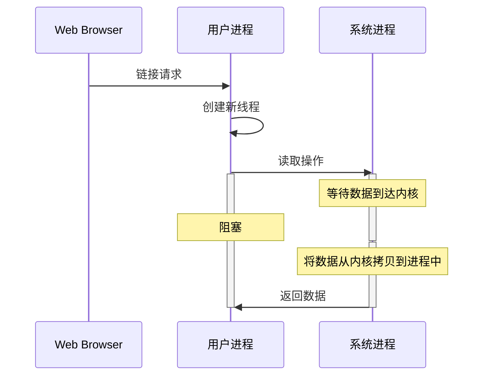
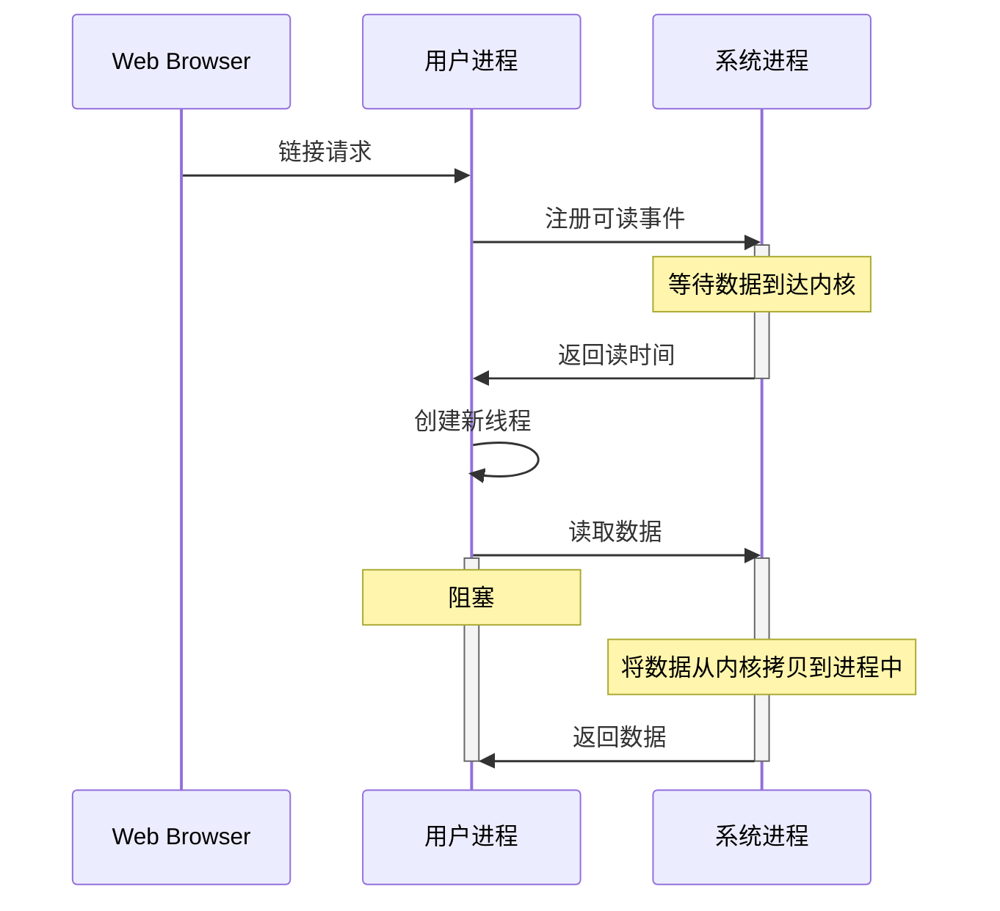

## 概述
IO是Input/Output的缩写，包括文件IO与网络IO。本文只讨论networkIO，即网络IO。以read函数举例：  
IO操作分为两个阶段：
1. 等待数据准备(Waiting for the data to be ready)
2. 将数据从内核拷贝到进程中(Copying the data from the kernel to the process)

根据第一阶段及第二阶段的用户线程是否阻塞区分， networkIO有以下五种IO模型：
1. blocking IO（阻塞IO）
2. nonblocking IO（非阻塞IO）
3. IO multiplexing（多路复用IO）
4. signal driven IO（信号驱动IO）
5. asynchronous IO（异步IO）

是否阻塞说的是第一个阶段，即等待数据准备阶段是否会阻塞。
而是否同步说的是第二阶段，即将数据从内核拷贝到进程这个真实的IO Operation操作阶段是否阻塞。

以下详细解释一下每种IO的不同
## blocking IO（阻塞IO）

如图所示：
系统在有链接到达时就创建线程，且在等待数据到达及将数据从内核拷贝到用户进程中线程一直处于阻塞状态
## nonblocking IO（非阻塞IO、NIO）

## IO multiplexing（多路复用IO）
## signal driven IO（信号驱动IO）
## asynchronous IO（异步IO）
